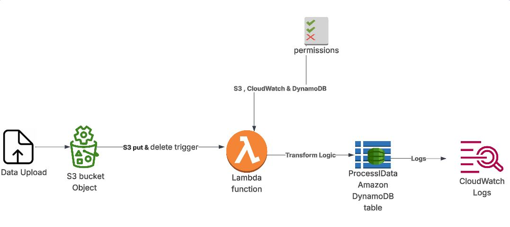

# Serverless-Data-PipelineServerless Data Pipeline (AWS Lambda + CloudWatch + S3 + DynamoDB)

## Overview
This project demonstrates how to build a **serverless ETL (Extract, Transform, Load) pipeline** using core AWS services: **S3**, **Lambda**, **DynamoDB**, and **CloudWatch**. It is ideal for data processing, transformation, and storage without managing servers — fully within AWS Free Tier limits.

## Architecture Diagram
The architecture diagram below shows the flow of data from ingestion in S3 to processing by Lambda and final storage in DynamoDB. CloudWatch is used for logging and monitoring.

## Components & Workflow

### 1. Amazon S3
- Stores raw input files (e.g., CSV, JSON).
- A file upload to S3 triggers the Lambda function via event notifications.

### 2. AWS Lambda
- Triggered by new files uploaded to S3.
- Reads and transforms the data.
- Loads the transformed data into DynamoDB.
- Outputs execution logs to CloudWatch.

### 3. Amazon DynamoDB
- NoSQL database for storing the final structured data.
- Highly scalable and low latency.

### 4. Amazon CloudWatch
- Automatically logs Lambda executions.
- Useful for debugging, alerts, and monitoring pipeline health.

## 🛠 How to Deploy

### Step 1: Create S3 Bucket
- Create an S3 bucket, e.g., `etl-input-bucket`
- Enable **event notification** for **ObjectCreated** to trigger your Lambda function

### Step 2: Create DynamoDB Table
- Create a table called `ProcessedData`
- Set a **primary key** like `recordId` or `filename`

### Step 3: Deploy Lambda Function
- Create a Lambda function using Python/Node.js
- Add **S3 trigger** (linked to your bucket)
- Grant IAM permissions to read from S3 and write to DynamoDB

### Step 4: Monitor with CloudWatch
- Lambda automatically sends logs to **CloudWatch**
- Use logs to verify processing or debug errors

## Deployment Screenshots

1. **CloudWatch Logs** – Logs from Lambda  
   
   

2. **DynamoDB Table** – View stored records  

---

3. **Lambda Function & Trigger** – Code + event trigger  
   
---

4. **S3 Bucket Permissions** – IAM roles and bucket access  
   
---

5. **S3 Uploads** – Sample input files  
   
---
## Benefits
- **Scalable**: Handles any amount of data with zero infrastructure management
- **Cost-Effective**: Fully serverless and within AWS Free Tier limits
- **Extensible**: Easily integrates with SNS, EventBridge, AWS Glue, Athena, etc.

## License
This project is licensed under the [MIT License](LICENSE).

## Author
**Emma**  
AWS/Data Architect  
[GitHub Profile](https://github.com/Cloud-Architect-Emma)
